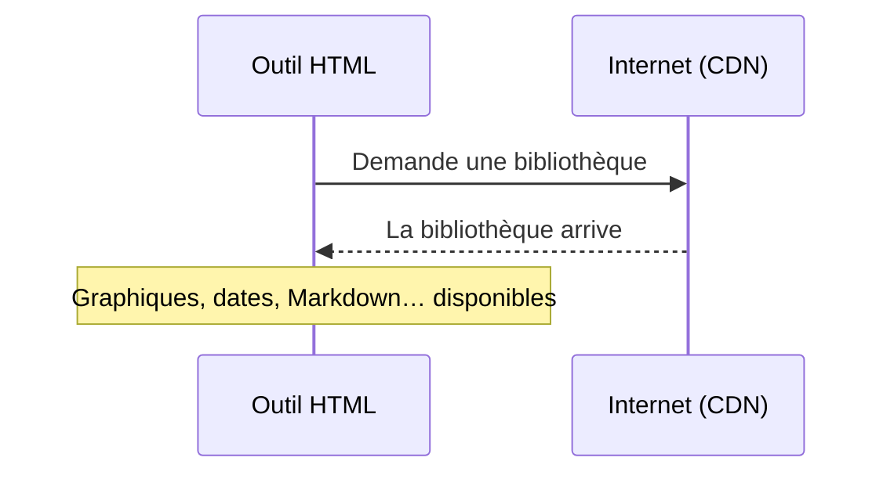

# Développer une application pédagogique avec une IA générative (vibe coding)

**LUDVIA#CH 2026 - ExplorCamp — François Jourde**

-- duration: 0s

---

## Accéder à cette présentation

  

  
https://jourde.github.io/training/2026/ludovia-ch.md

-- duration: 0s

---

## *Combien d'entre vous ont déjà demandé à une IA de générer du code — même sans savoir coder ?*

-- duration: 1m30s

---

## Objectifs

➜ **Se repérer** dans ce qu'on appelle vibe coding

➜ Identifier les **points de vigilance** techniques et institutionnels

➜ Examiner un **résultat concret** : le Learning Designer

➜ Repartir avec des **idées** et des **ressources**

-- duration: 0s

---

# Le vibe coding

-- duration: 0s

---

## Le vibe coding — définition

Terme popularisé par **Andrej Karpathy** en 2025.

**Coder en langage naturel** : décrire ce qu'on veut obtenir et laisser une IA générer le code.

Ce n'est **pas** du no-code au sens traditionnel.  
C'est du **code généré par dialogue** : l'humain pilote l'intention, l'IA exécute techniquement.

-- duration: 2m

---

## Deux approches

**Vibe coding "pur"**: faire confiance à l'IA et "*oublier que le code existe*" (Karpathy). Démarche adaptée aux projets simples, où la vitesse prime.
- Ce n'est pas du développement web professionnel à grande échelle.
- C'est la fabrication d'un outil numérique utile qui résout bien un problème.

**≠ Développement assisté par IA**: utiliser l'IA sur des tâches spécifiques de projets avancés.

-- duration: 2m

---

## De la consommation à la création

Le vibe coding fait passer le numérique (éducatif) d'une logique de **consommation** à une logique de **création**.

Il permet aux **non-développeurs** de produire des outils adaptés à leur contexte, en exerçant leur **créativité** et leur **expertise professionnelle**.

Cette capacité reste **dépendante des grandes infrastructures numériques**, mais elle transforme la posture professionnelle : ne plus seulement choisir des outils, mais **construire un environnement d'action plus ajusté à ses besoins**.

-- duration: 4m

---

# Démarche

-- duration: 0s

---

## choisir un outil

- Système d'IA générative
	- généraliste
	- spécialisé

Les systèmes d'IA évoluent constamment.

---

## Boucle de travail typique (démonstration)

| #   | Étape                    | Description                                                                                                                                                                                       |
| --- | ------------------------ | ------------------------------------------------------------------------------------------------------------------------------------------------------------------------------------------------- |
| 1   | **Décrire l'objectif**   | Un prompt en langage naturel : "*Crée une application monopage présentant un formulaire d'auto-évaluation à 5 critères pour un oral d'anglais au lycée, avec une barre de progression visuelle.*" |
| 2   | **L'IA génère le code**  | Elle interprète la demande et produit une première version.                                                                                                                                       |
| 3   | **Exécuter et observer** | On ouvre le fichier dans le navigateur pour vérifier que le formulaire s'affiche et fonctionne comme prévu.                                                                                       |
| 4   | **Corriger et affiner**  | Si le résultat est incomplet, on précise : *"Les critères doivent être modifiables par l'enseignant."*                                                                                            |
| 5   | **Itérer**               | Cette boucle — décrire, générer, tester, affiner — se répète jusqu'à ce que l'outil corresponde au besoin pédagogique.                                                                            |

-- duration: 5m

---

# Anatomie d'un outil HTML

-- duration: 0s

---

## Les principes sous-jacents

Optimiser pour : **simplicité, portabilité, rapidité, collaboration facile avec les LLMs.**

Des outils faciles à générer, à exécuter, à partager, à modifier.

-- duration: 1m30s

---

## Un seul fichier : `outil.html`

| Couche | Rôle |
|---|---|
| **HTML** | Structure et contenu |
| **CSS** | Mise en forme visuelle |
| **JavaScript** | Comportement et interactivité |

**Pourquoi un seul fichier ?**

| Avantage | Ce que ça signifie |
|---|---|
| **Autonome** | Tout tient dans un seul document |
| **Portable** | Un fichier à partager, envoyer, sauvegarder — sans installation |
| **Modifiable par un LLM** | *"Voici mon outil — améliore cette fonctionnalité."* |
| **Durable** | Résiste aux évolutions de l'écosystème numérique |

-- duration: 1m30s

---

## Dépendances et CDN

Une **dépendance** est une bibliothèque externe qui ajoute une capacité à l'outil : graphiques, sélecteur de dates, rendu Markdown…

Un **CDN** (Content Delivery Network) permet de la charger directement depuis le web, sans téléchargement ni installation :

L'outil reste léger, portable, facile à partager.

**Règle :** utiliser le moins de dépendances possible.

-- duration: 1m

---

## Rester petit

Un outil petit est plus facile à comprendre, corriger, modifier — ou réécrire entièrement si nécessaire.

Cela compte aussi quand on travaille avec un LLM :
- L'outil entier tient dans la fenêtre de contexte
- Le modèle le comprend rapidement
- On peut le régénérer ou le refactoriser (restructurer sans changer ce qu'il fait) en une seule opération

-- duration: 2m

---

## Versionner son travail, notamment via GitHub ou GitLab

- **Sauvegarder sans écraser** — chaque version est conservée et récupérable
- **Revenir en arrière** — si une modification casse quelque chose, on restaure l'état précédent
- **Partager et diffuser** — un lien suffit pour rendre un outil accessible à d'autres
- **Collaborer** — plusieurs personnes peuvent contribuer au même projet
- **Documenter** — l'historique des modifications trace les décisions prises au fil du temps

-- duration: 2m30s

---

## ⚠️ Points de vigilance : sécurité et données

| Point de vigilance          | Risque                                                                                           | Règle pratique                                                                              |
| --------------------------- | ------------------------------------------------------------------------------------------------ | ------------------------------------------------------------------------------------------- |
| **Données personnelles**    | Tout outil traitant des données personnelles est soumis au RGPD (Suisse : LPD/FADP)              | *Ne jamais coller de données nominatives dans un prompt. Tester avec des données fictives.* |
| **Applications connectées** | Un outil qui envoie des données vers un serveur externe crée un vecteur de risque                | *Préférer une architecture locale sans requête réseau*                                      |
| **Sécurité du code**        | Le code généré par IA peut contenir des failles inaperçues (injections, dépendances vulnérables) | *Ne pas déployer sur un réseau d'établissement sans revue par un responsable informatique*  |
| **Front-end statique**      | La complexité augmente les risques et réduit le contrôle                                         | *Rester sur des fichiers HTML + CSS + JS locaux, sans serveur ni compte utilisateur*        |

-- duration: 2m

---

## Exemples d'instructions

**Démarrage d'un projet**
> "Développe une application monopage en HTML. Contexte : [contexte]. Fonctionnalités : [comportement attendu]."

**Correction d'erreur**
> "La fonctionnalité [X] ne fonctionne plus après que j'ai ajouté [Y]. Comportement attendu : [décrire]. Comportement observé : [décrire]. Code actuel : [coller]. Identifie l'origine du problème et propose une correction minimale."

**Accessibilité**
> "Révise ce code pour garantir la conformité aux WCAG 2.1 niveau AA (norme EN 301 549). Assure : HTML sémantique, navigation complète au clavier, indicateurs de focus visibles, rapports de contraste conformes, gestion accessible des formulaires, ARIA si nécessaire, mise en page adaptative jusqu'à un zoom de 200 %, compatibilité avec les lecteurs d'écran et prise en charge du contenu multilingue. Voici le code actuel : [coller]."

**Audit du code**
> "Analyse ce code et produis un rapport structuré couvrant : (1) erreurs ou bugs potentiels, (2) failles de sécurité, (3) problèmes de performance, (4) lisibilité et maintenabilité, (5) dépendances externes et leurs risques. Pour chaque point, indique le niveau de priorité (critique / majeur / mineur) et propose une correction concrète. Voici le code : [coller]."

-- duration: 5m30s

---

# En pratique

-- duration: 0s

---

## Illustration (1) : l'interface de diaporama utilisée ici

**[Markdown Slide Deck](https://github.com/jourde/markdown-slidedeck)** — application monopage légère et accessible.

- Convertit des fichiers Markdown ou HTML en présentation interactive
- Repères de diapositives et de notes personnalisables
- Rendu avancé : tableaux, médias, formules mathématiques, Mermaid
- Navigation au clavier, recherche intégrée
- Indicateur de progression en forme de ligne de train

-- duration: 2m

---

## Illustration (2) : le Learning Designer

Démonstration

- Besoin initial  
- Démonstration

  

  
https://github.com/jourde/learning-designer

-- duration: 18m

---

# Pour aller plus loin

-- duration: 0s

---

## Discussion

> ***"Pensez à votre contexte de travail. Y a-t-il un outil que vous auriez voulu avoir — et qui n'existe pas, ou qui n'existe pas sous la forme dont vous auriez besoin ?"***

-- duration: 12m

---

## Les 3 idées à emporter

**1. Le vibe coding, c'est surtout de la formulation.**

**2. L'IA produit vite, mais ne valide pas.**

**3. L'outil le plus utile n'est pas le plus sophistiqué.**

-- duration: 2m

---

## Ressources
### Exemples
- [Prototypes personnels (F. Jourde) sur GitHub](https://github.com/jourde)
- [La Ressourcerie de la Forge des Communs Numériques Éducatifs](https://ressourcerie.forge.apps.education.fr/)
### Conseils
- [Page de conseils par Yann Houry](https://www.ralentirtravaux.com/apps/vibe-coding/)
### Outils
- [https://github.com/roboco-io/awesome-vibecoding](https://github.com/roboco-io/awesome-vibecoding)
### Contact pour questions ou échanges ultérieurs
- [francois@jourde.dev](mailto:francois@jourde.dev) | [linkedin.com/in/jourde/](https://www.linkedin.com/in/jourde/)

-- duration: 1m30s

[def]: https://ressourcerie.forge.apps.education.fr/
